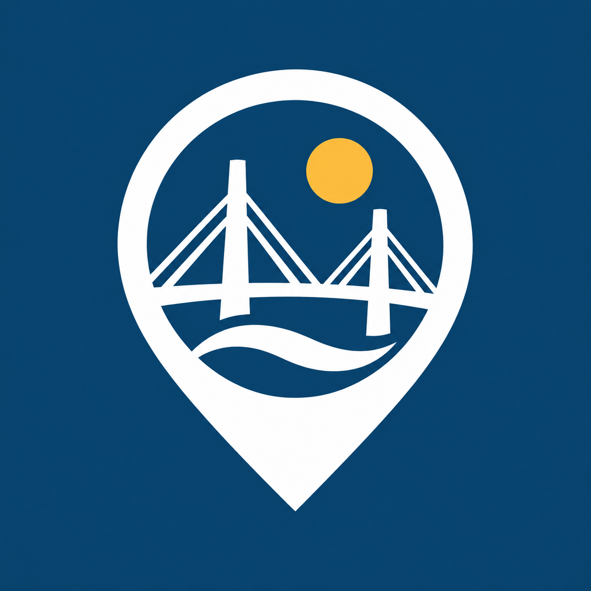
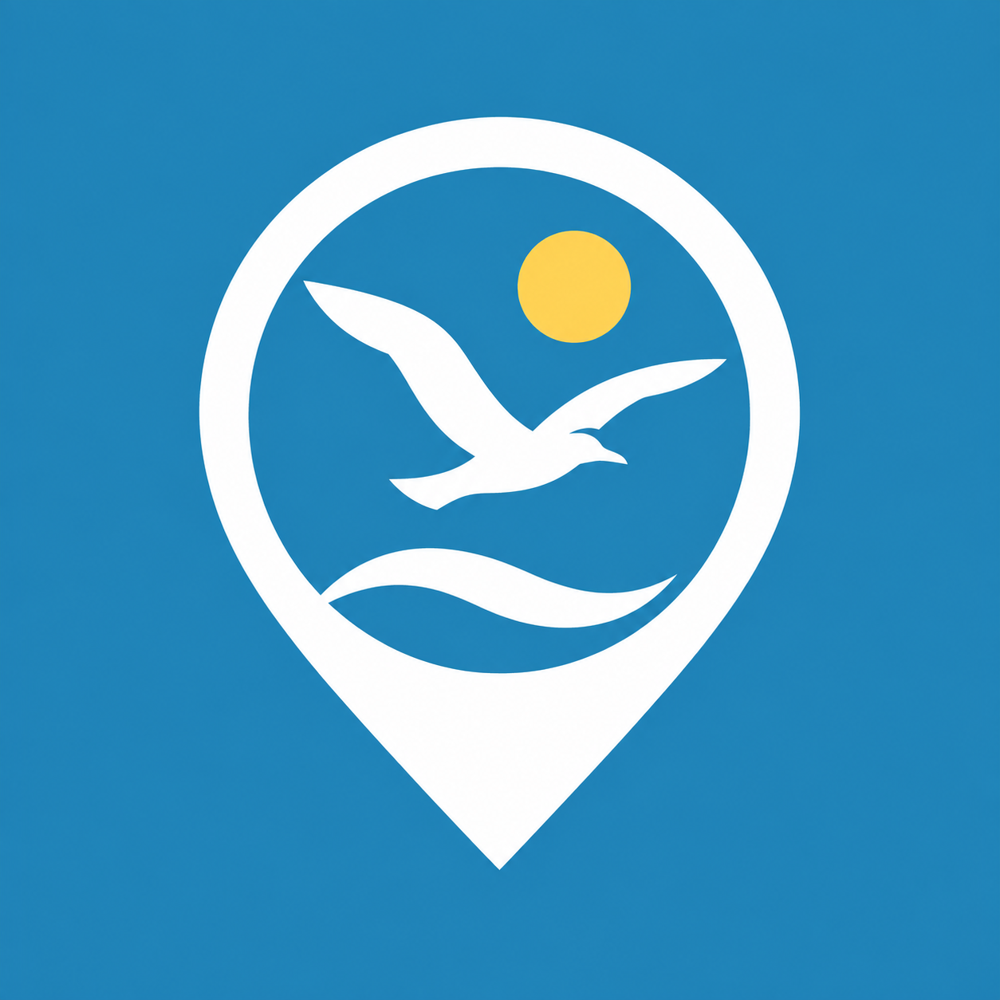
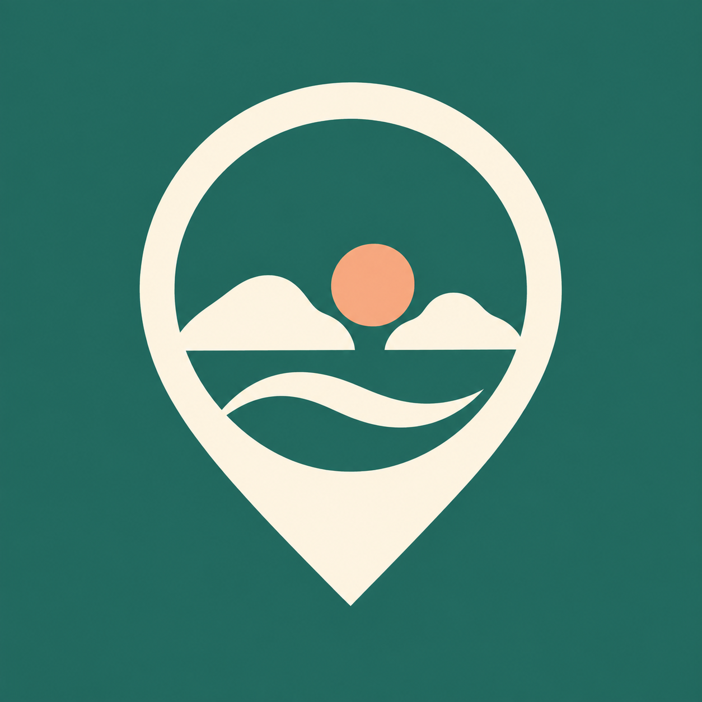

# 인천 누림지도 투표용 아이콘

지도 핀 형태를 공통으로 유지한 네 가지 후보입니다. 현재 사이트에는 적용하지 않았습니다.

- A: 바다를 잇는 다리 — 깊은 파랑·금색
- B: 길을 밝히는 등대 — 남색·아이보리·주황
- C: 자유로운 갈매기 — 하늘색·흰색·연노랑
- D: 함께 품는 섬 — 초록·크림색·살구색

originals 폴더에는 수정 및 투표에 사용할 고해상도 PNG 원본이 있습니다. 투표할 때 A~D 중 디자인과 색상을 각각 고를 수 있습니다.

## 제작 방식과 최종 프롬프트
내장 ImageGen을 사용했습니다. 첫 다리 지도핀을 공통 참조 이미지로 사용하고, 각 후보의 상징과 색 조합을 따로 지시했습니다. 미리보기는 크기만 변환했습니다.

### A. 바다를 잇는 다리

Create finished voting candidate A for Incheon Nurim Map. Use the reference to preserve its distinctive large MAP LOCATION PIN outline, rounded top and pointed solid lower tip, similar thick border and generous margins. The pin must remain unmistakable at a glance. Redesign the INNER scene as a very simplified two-pylon cable bridge above one sea wave, and a single small sun. Thoughtfully coordinated color palette: deep ocean blue background #123F62, clean white pin and bridge, warm golden sun #F6BC54. The new palette must visibly replace the old teal palette, and communicate the mood of this coastal-city symbol. All scene elements stay INSIDE the pin outline. Same polished visual language: extremely simple bold balanced flat shapes, minimal detail, high contrast at 32px. Opaque uniform background color edge-to-edge, no transparency, gradients, textures, glow, 3D or shadows. Original welcoming community-service identity, not the official Incheon emblem. NO text, letters, numbers, captions, mockups, extra frames, collages. One square icon.

### B. 길을 밝히는 등대

Create finished voting candidate B for Incheon Nurim Map. Use the reference to preserve its distinctive large MAP LOCATION PIN outline, rounded top and pointed solid lower tip, similar thick border and generous margins. The pin must remain unmistakable at a glance. Redesign the INNER scene as one compact lighthouse above a sea wave, a small illuminated lamp with short light rays. Thoughtfully coordinated color palette: midnight navy background #243857, warm ivory pin and lighthouse #FFF6E6, luminous orange-coral lamp and rays #F58C65. The new palette must visibly replace the old teal palette, and communicate the mood of this coastal-city symbol. All scene elements stay INSIDE the pin outline. Same polished visual language: extremely simple bold balanced flat shapes, minimal detail, high contrast at 32px. Opaque uniform background color edge-to-edge, no transparency, gradients, textures, glow, 3D or shadows. Original welcoming community-service identity, not the official Incheon emblem. NO text, letters, numbers, captions, mockups, extra frames, collages. One square icon.

### C. 자유로운 갈매기

Create finished voting candidate C for Incheon Nurim Map. Use the reference to preserve its distinctive large MAP LOCATION PIN outline, rounded top and pointed solid lower tip, similar thick border and generous margins. The pin must remain unmistakable at a glance. Redesign the INNER scene as one graceful flying seagull with spread wings above one simple sea wave and a small sun. Thoughtfully coordinated color palette: clear coastal sky-blue background #247DA8, bright white pin and seagull, soft yellow sun #FFD36A. The new palette must visibly replace the old teal palette, and communicate the mood of this coastal-city symbol. All scene elements stay INSIDE the pin outline. Same polished visual language: extremely simple bold balanced flat shapes, minimal detail, high contrast at 32px. Opaque uniform background color edge-to-edge, no transparency, gradients, textures, glow, 3D or shadows. Original welcoming community-service identity, not the official Incheon emblem. NO text, letters, numbers, captions, mockups, extra frames, collages. One square icon.

### D. 함께 품는 섬

Create finished voting candidate D for Incheon Nurim Map. Use the reference to preserve its distinctive large MAP LOCATION PIN outline, rounded top and pointed solid lower tip, similar thick border and generous margins. The pin must remain unmistakable at a glance. Redesign the INNER scene as two simple rounded islands with a setting sun between them and one sea wave. Thoughtfully coordinated color palette: calm deep coastal green background #28665C, warm cream pin and islands #FFF4DF, soft apricot sunset #F6AE87. The new palette must visibly replace the old teal palette, and communicate the mood of this coastal-city symbol. All scene elements stay INSIDE the pin outline. Same polished visual language: extremely simple bold balanced flat shapes, minimal detail, high contrast at 32px. Opaque uniform background color edge-to-edge, no transparency, gradients, textures, glow, 3D or shadows. Original welcoming community-service identity, not the official Incheon emblem. NO text, letters, numbers, captions, mockups, extra frames, collages. One square icon.

## 투표 시안

| A. 바다를 잇는 다리 | B. 길을 밝히는 등대 |
| --- | --- |
|  |  |
| 깊은 파랑·금색 | 남색·아이보리·주황 |

| C. 자유로운 갈매기 | D. 함께 품는 섬 |
| --- | --- |
|  |  |
| 하늘색·흰색·연노랑 | 초록·크림색·살구색 |

## 회사에서 이어서 작업

최신 작업 브랜치는 `codex/survey-integration`입니다. 회사에서 작업 중인 변경을 먼저 저장한 뒤 이 브랜치의 최신 내용을 받아 주세요. 이 폴더의 README와 원본 이미지를 기준으로 투표 결과를 반영합니다.

합의된 기준: 지도 위치 핀 형태를 유지하고 인천의 상징을 안쪽에 표현합니다. 디자인과 색은 따로 선택해 조합할 수 있습니다. 현재 운영 사이트는 v95 아이콘을 사용하며, 이 네 후보는 아직 운영에 반영하지 않았습니다. 투표 결과 확정 후 선택한 시안을 파비콘·공유 이미지·홈페이지 로고 크기로 변환합니다.